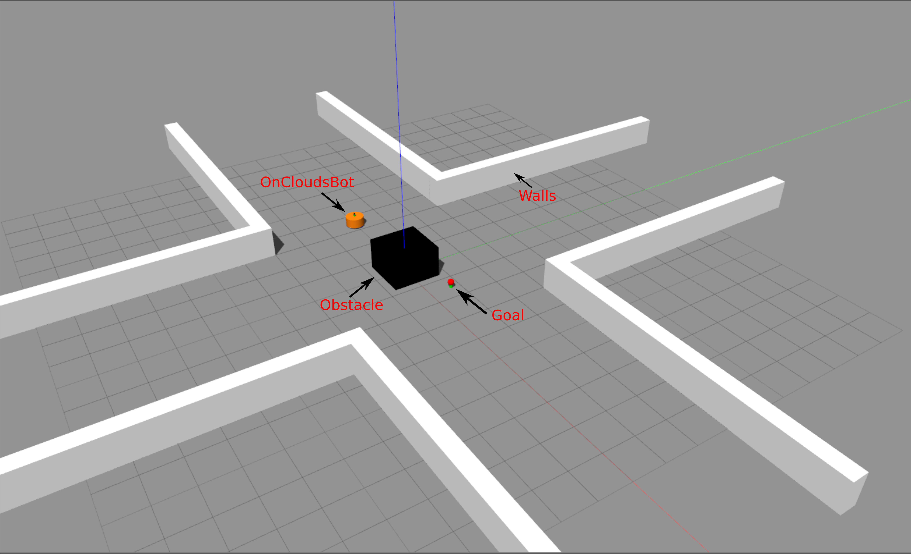
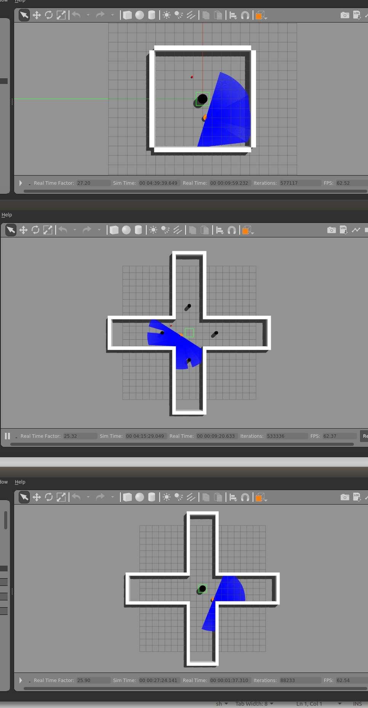

# ros-melodic-nvidia-docker_gazebo-reinforcement-learning #
## Overview: ##
This package provides the reinforcement learning with Q_table using gazebo and gym. It runs entirely in nvidia-docker envs of which installed ros-melodic and gazebo. 

The OnCloudsBot uses LiDAR scan to detect then avoid the obstacles while planning to a designated goal point in a safe and quick manner.

<br/>
<p align="center">

<figcaption align = "center"><b>Fig.1 - General design of gazebo env for learning</b></figcaption>
<br/>

<p float="left">
  
   
  <figcaption align = "center"><b>Fig.2 - General results obtained in learning processes</b></figcaption>
</p>

## Requirements: ##
* OS : Ubuntu 18.04
* libraries : docker ros-melodic gazebo python2.7 gym

## Installation docker: ##
https://docs.docker.com/install/linux/docker-ce/ubuntu/
```shell
$ sudo apt-get update
$ sudo apt-get install -y docker-ce
```

## Installation nvidia-docker (nvidia with gpus): ##
https://github.com/NVIDIA/nvidia-docker

## Installation ros-melodic-nvidia-docker_gazebo-rl: ##
```shell
$ git clone https://github.com/truongsatthu/ros-melodic-nvidia-docker_gazebo-rl.git 
```

<br/>
<p align="center">
___________ maintenance by "nguyentruong.oto@gmail.com" ___________ 
+++++++++++++++++++++++++++++++++++++++++++++++++++++++++++++++++++
</p>

## Usage: ##
### 1. Creating nvidia docker image ###
```shell
$ cd ros-melodic-nvidia-docker/docker
$ ./build.sh -n -c
    -n: use this option for nvidia
    -c: use this option for cache
```

### 2. Creating gazebo docker image ###
```shell
$ cd ros-melodic-nvidia-docker/docker
$ ./build.sh -g -c
    -g: use this option for gazebo
    -c: use this option for cache
```

### 3. Training with Q_learning ###
#### __Catkin:__ ####
```shell
cd ros-melodic-nvidia-docker/bin
./dockerRun.sh -n -c catkin rasMake.sh rl
 -n: use this option for nvidia-docker
 -c: use this option for cache
```

#### __Training:__ #### 
__Envs/Terminal 1:__
```shell
$ ./auto_start_gaz-rel.sh
$ cd ~/ros-melodic-nvidia-docker/bin ; ./raslaunch.sh rel
$ cd ~/ros-melodic-nvidia-docker/bin ; ./raslaunch.sh tes
  -rel: use for training the model to get Q-table
  -tes: use for testing the results of achieved Q-table
```

__Envs/Terminal 2__
```shell
$ ./auto_start_gaz-rel1.sh
$ cd ~/ros-melodic-nvidia-docker/bin ; ./raslaunch1.sh rel
$ cd ~/ros-melodic-nvidia-docker/bin ; ./raslaunch1.sh tes
  -rel: use for training the model to get Q-table
  -tes: use for testing the results of achieved Q-table
```

__Envs/Terminal 3__
```shell
$ ./auto_start_gaz-rel2.sh
$ cd ~/ros-melodic-nvidia-docker/bin ; ./raslaunch2.sh rel
$ cd ~/ros-melodic-nvidia-docker/bin ; ./raslaunch2.sh tes
  -rel: use for training the model to get Q-table
  -tes: use for testing the results of achieved Q-table
```

Multiple gazebo-rl models can be executed at once using the provided docker image with different container networks. It is shown as follows:

<br/>
<p align="center">

<figcaption align = "center"><b>Fig.3 - Multiple gazebo envs learning</b></figcaption>
<br/>

## For more detailed information ##
Check on its Confluence repo: 
https://bitbucket.org/oncloudslab/***/

## rasEnv ##
* Set env for ros remote (optional)
```shell
$ ./rasEnv.sh [-i ip ] [main|sub]
  main: for tx2 main
  sub: for tx2 sub
  -i: set local ip
```

* if there are no opts, set localhost:
```shell
$ ./rasEnv.sh
```
